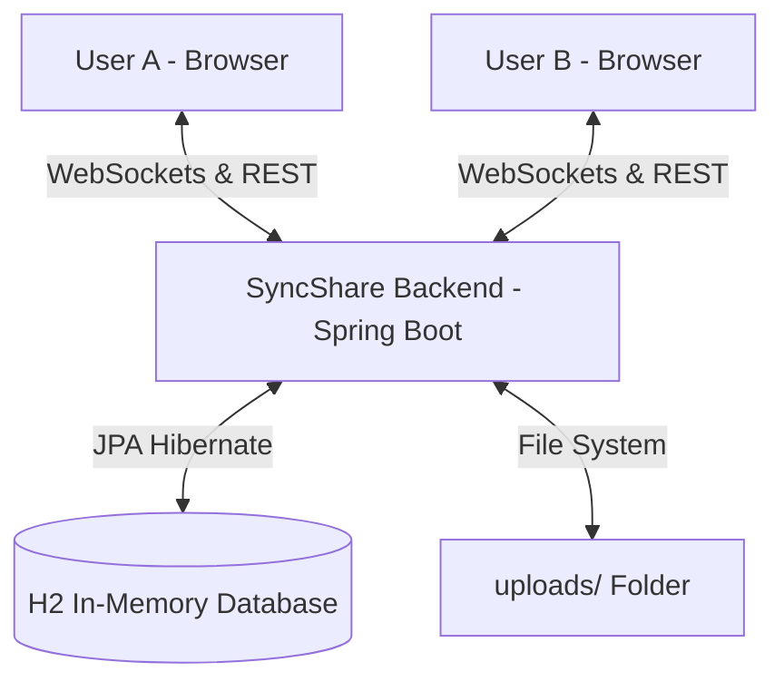

# SyncShare - Real-Time Code & File Sharing Platform

SyncShare is a secure, password-protected real-time collaboration space designed for developers. It allows users to create workspaces via unique links, write and synchronize code live in multiple languages, send chat messages, and drop files instantly. 

Built with **Java Spring Boot** (in-memory H2 database, raw WebSockets, JPA) and **React** (Vite, Monaco Editor, Vanilla Glassmorphism CSS).

---

## 🏗️ Architecture



---

## ✨ Features

- **Real-Time Code Syncing**: Live editor powered by VS Code's **Monaco Editor** syncing keystrokes instantly across all workspace participants.
- **Security & Password Protection**: Workspaces are protected by optional passwords. Links are unique UUIDs, prompting users to authenticate before entering.
- **Instant File Sharing**: Drag-and-drop attachments panel supporting code, text, or reference files up to 50MB.
- **Collaborative Chat**: Side-panel chat context synchronized in real-time.
- **Aesthetic UI**: Translucent glassmorphism panels, glowing indicator highlights, modern dark typography, and fluid hover animations.
- **Zero Configuration**: Ready to boot locally with an in-memory database and automated database migrations.

---

## 📂 Project Structure

```text
realtime-codeshare/
├── backend/                  # Spring Boot 3.x/4.x Application
│   ├── src/main/java/com/codeshare/backend/
│   │   ├── controller/      # REST API Controllers (Rooms, File Uploads)
│   │   ├── model/           # Database Entities (Room, SharedFile)
│   │   ├── repository/      # JPA Data Repositories
│   │   └── websocket/       # WebSocket Configuration & Real-Time Message Handler
│   ├── src/main/resources/  # application.properties & Static configs
│   ├── uploads/             # Stores uploaded files locally (auto-created)
│   └── pom.xml              # Maven dependencies
│
└── frontend/                 # Vite React Application
    ├── src/
    │   ├── App.jsx          # Custom Router, WebSocket hooks, & Layout
    │   ├── index.css        # Glassmorphism CSS Stylesheet
    │   └── main.jsx         # App bootstrapping
    ├── index.html           # Main template with SEO metadata
    └── package.json         # Node dependencies
```

---

## 🚀 Getting Started

### Prerequisites
- **Java JDK 17 or higher** (JDK 25 compatible)
- **Node.js** (v22+) and **npm**

### Step 1: Run the Backend Server
1. Navigate to the `backend/` directory:
   ```bash
   cd backend
   ```
2. Run the project using Maven Wrapper:
   - On Windows (Command Prompt / PowerShell):
     ```cmd
     .\mvnw.cmd spring-boot:run
     ```
   - On Linux / macOS:
     ```bash
     chmod +x mvnw
     ./mvnw spring-boot:run
     ```
3. The server starts on **`http://localhost:8080`**.
4. You can access the H2 console at `http://localhost:8080/h2-console` (JDBC URL: `jdbc:h2:mem:codesharedb`, Username: `sa`, no password).

### Step 2: Run the Frontend Server
1. Navigate to the `frontend/` directory:
   ```bash
   cd ../frontend
   ```
2. Start the Vite development server:
   ```bash
   npm run dev
   ```
3. Open the local address provided in the terminal (typically **`http://localhost:5173`**).

---

## 🔌 API Endpoints

### Rooms
- `POST /api/rooms`: Create a new room.
  - **Body**: `{ "name": "Room Name", "password": "OptionalPassword" }`
  - **Response**: `{ "id": "uuid", "name": "...", "passwordProtected": true/false }`
- `GET /api/rooms/{id}`: Fetch metadata for a room.
- `POST /api/rooms/{id}/verify`: Verify join password.
  - **Body**: `{ "password": "password" }`

### Files
- `POST /api/files/upload`: Upload file.
  - **Multipart Form Data**: `file` (File object), `roomId` (String UUID)
- `GET /api/files/room/{roomId}`: List shared files in a room.
- `GET /api/files/{id}/download`: Download shared file.

---

## 💬 WebSocket Protocol

Connecting client establishes a connection at `ws://localhost:8080/ws/code`. All updates are communicated using JSON payloads:

### Events Supported:
1. **Join Room (`JOIN`)**
   ```json
   { "type": "JOIN", "roomId": "room-uuid", "sender": "Username" }
   ```
2. **Sync State (`SYNC` - Server to Client)**
   ```json
   { "type": "SYNC", "roomId": "room-uuid", "data": { "code": "code...", "language": "javascript" } }
   ```
3. **Live Typing (`CODE_CHANGE`)**
   ```json
   { "type": "CODE_CHANGE", "roomId": "room-uuid", "sender": "Username", "data": "new code content..." }
   ```
4. **Language Change (`LANGUAGE_CHANGE`)**
   ```json
   { "type": "LANGUAGE_CHANGE", "roomId": "room-uuid", "sender": "Username", "data": "python" }
   ```
5. **Chat Message (`CHAT`)**
   ```json
   { "type": "CHAT", "roomId": "room-uuid", "sender": "Username", "data": "Hello World!" }
   ```
